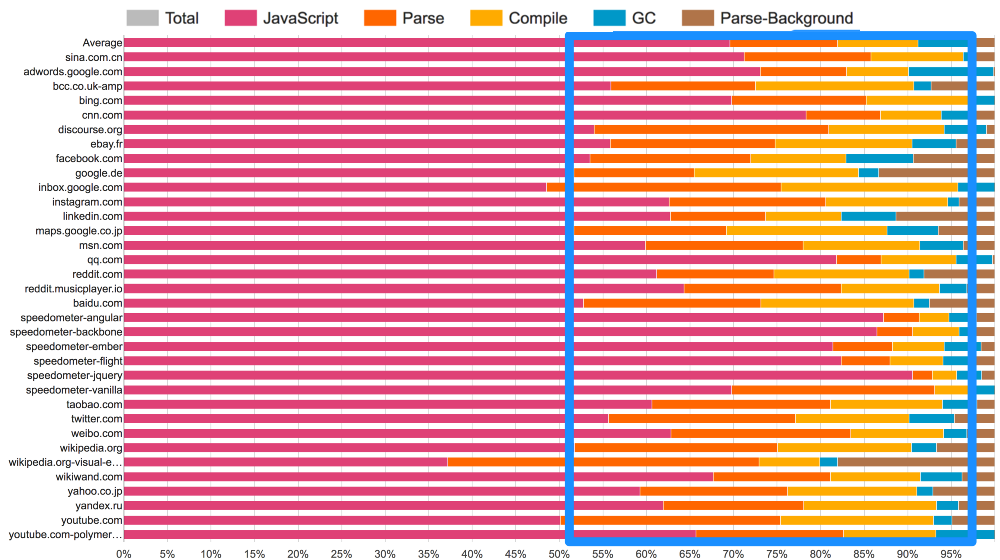
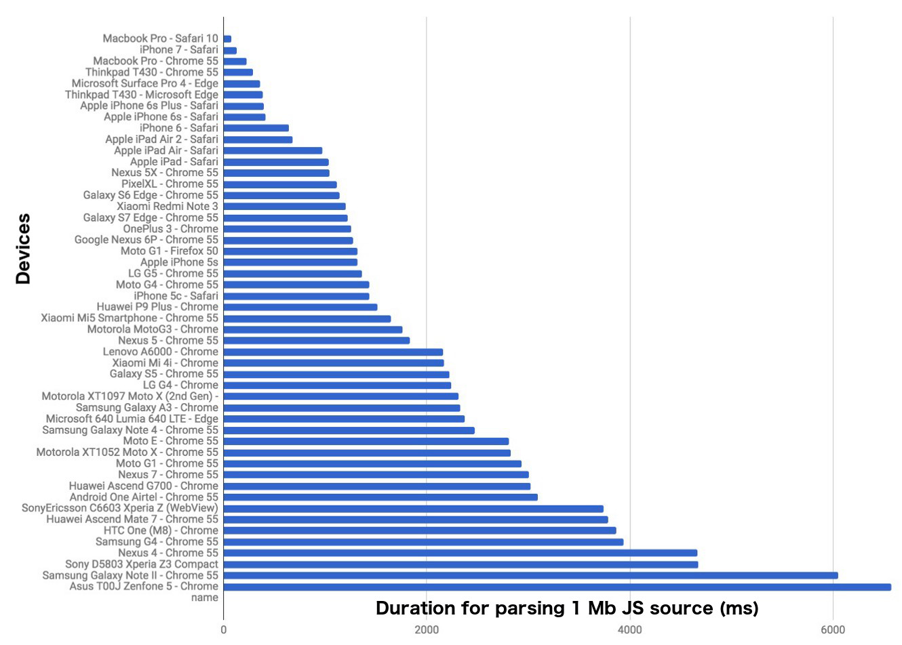
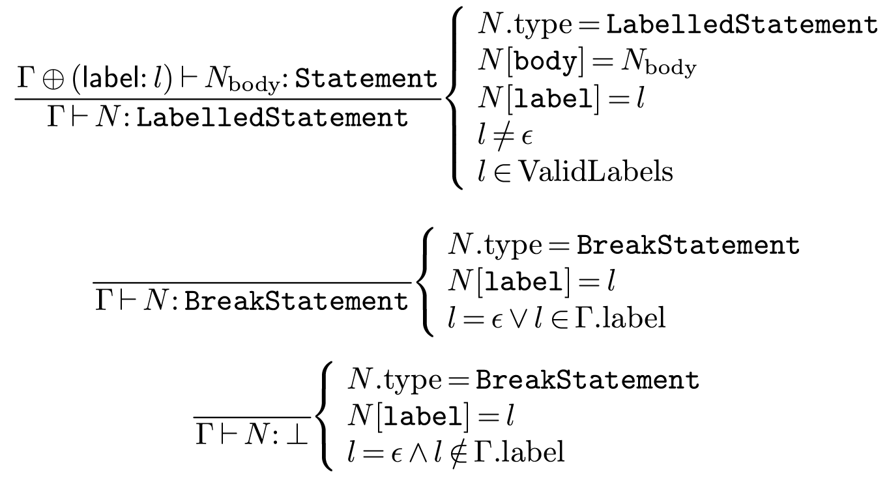
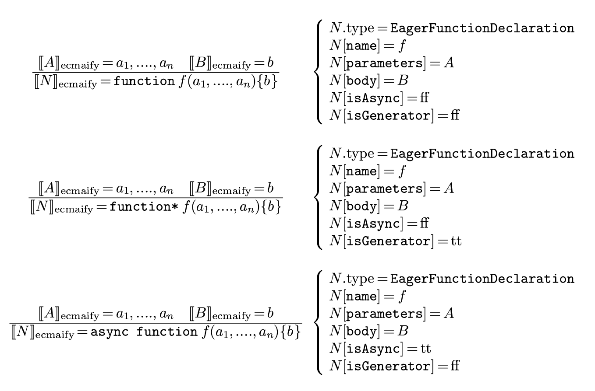
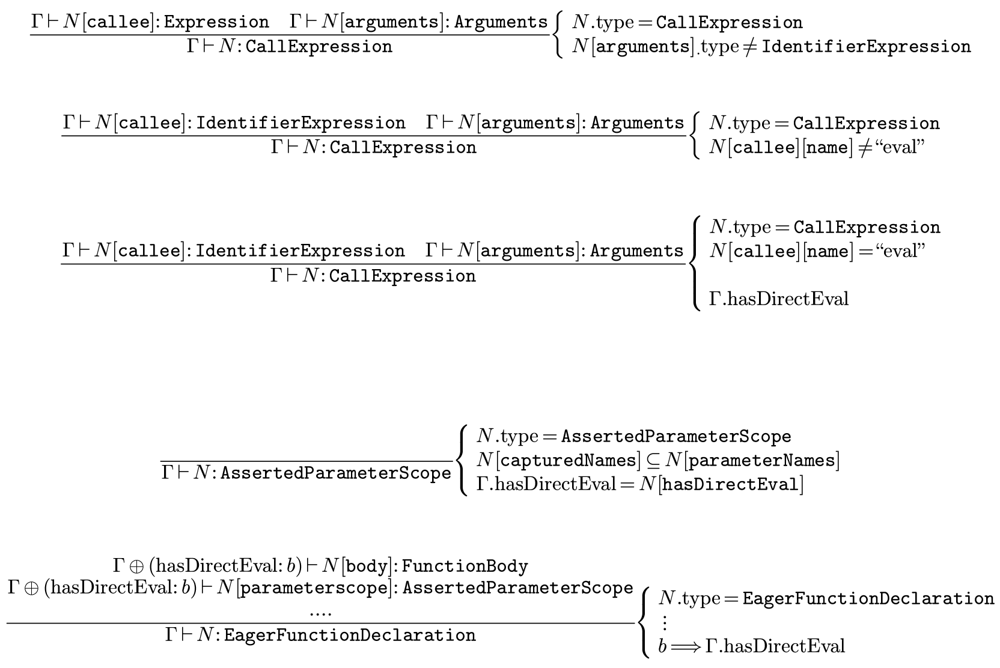
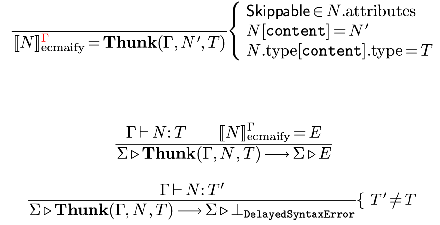
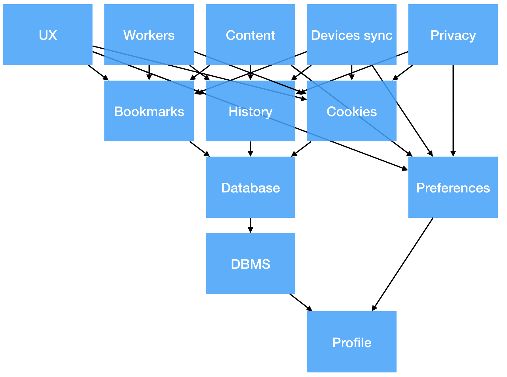
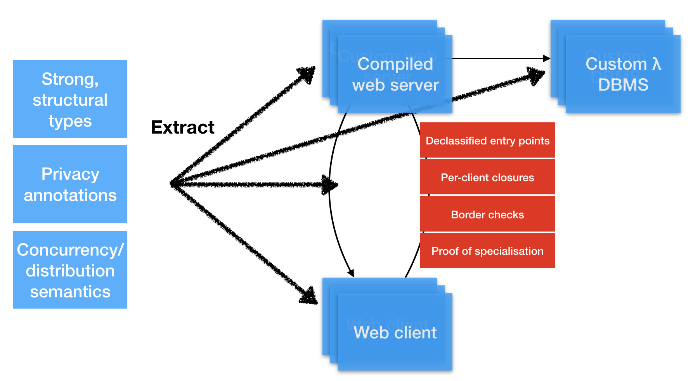
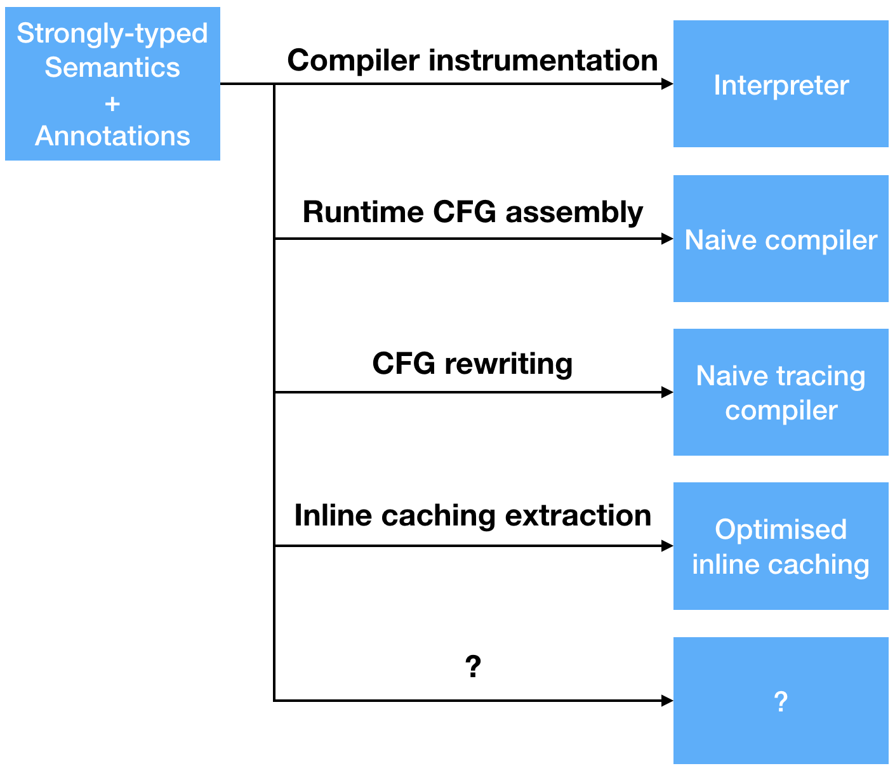
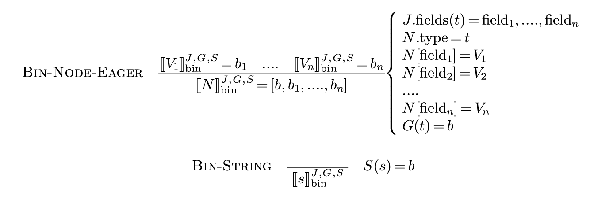

.center[# The JavaScript Binary AST]

.center[or]

.center[**How fast can JavaScript start?**]

.center[[David Teller](#about), Mozilla]

.center[With Shu-yu Guo (Bloomberg), Vladan Djeric (Facebook WebPerf)]

---
name: toc

# Table of contents

1. [Problem statement](#problem)
2. [The high cost of syntax](#lexing)
3. [The true cost of analyzing](#analyzing)
4. [The unnecessary cost of parsing](#parsing)
5. [The avoidable cost of fetching](#fetching)
6. [Conclusions](#conclusions)

---
name: problem

# I. Problem statement

---

## Web application performance matters

- "53% of visits are abandoned if a mobile site takes more than **3 seconds** to load" (source: [DoubleClick](https://docs.google.com/viewerng/viewer?url=https://storage.googleapis.com/doubleclick-prod/documents/The_Need_for_Mobile_Speed_-_FINAL.pdf))

--

- "Apps became interactive in **8 seconds** on desktop (using cable) and **16 seconds** on mobile (Moto G4 over 3G)"(median value, source: [Addy Osmani](https://medium.com/reloading/javascript-start-up-performance-69200f43b201), Google)

---

name: bonus_durations



---

## Parsing is slow



.small[Source: [Addy Osmani](https://medium.com/reloading/javascript-start-up-performance-69200f43b201), Google]

---

## Recommendations around the web

- "[Measure](https://philipwalton.com/articles/why-web-developers-need-to-care-about-interactivity/)"
- "[Make your JS smaller](https://infrequently.org/2017/10/can-you-afford-it-real-world-web-performance-budgets/)"
- "[Use server push](https://www.youtube.com/watch?v=RWLzUnESylc)"
- "Make your JS lazy"
- "Minimize your JS"
- ...

--

Sure, but...

---

.center[## Why is it a bottleneck?]

---


## JS startup pipeline

1. Full fetch + decompress.
2. Transcode to UTF-8.
3. Full parse + full verify + partial AST build.
4. Bytecode compile partial AST.
5. Start interpreter.

⇒ Per-byte cost is high.

---

## Native startup

By contrast:

- No verification.
- Everything is loaded lazily.

⇒ Per-byte cost is ~0.


---


## Better question

Could we get JS startup close to Native startup without changing the semantics of JavaScript?

---

## Requirements

- Not a new programming language.
- Not a subset or a superset of JavaScript.
- Not a bytecode.
- Do not change the semantics of existing programs.
- Do not change the semantics of well-formed programs.
- As transparent as possible.
- Compatible with future versions of JavaScript.

---
name: lexing

# II. The high cost of syntax

---

## The high cost of syntax

Lexing JavaScript is pretty ugly:

- is `for` an identifier or a keyword?
- is `/` an operator, a regexp or a comment?
- is `"use string"` a string or a directive?
- is ` ` a `;`?
- ...

---

## Question 1.1

Could we speed parsing by using a better syntax?

---

## Experiment 1.1

Protocol:

1. Extract (unsafe) binary format from SpiderMonkey AST.
2. Replace text parsing with binary parsing.
3. Benchmark time spent verifying during text parse.
4. Compare speed (Facebook Chat, Firefox Devtools).

---

## Experiment 1.1 - Data & Conclusion

> Could we speed parsing by using a better lexer?

Durations:

- Unsafe Binary Parse vs. Text Parse: *0.3
- Original verification time: 𝜀

⇒ Experiment conclusive. Let's go Binary AST.

---

## Experiment 1.2

Can we design a binary source format to transport ASTs,
within our requirements?

---

## Strategy

- Specify separately the AST and the binary container.
- Specify AST ⇒ original text-based semantics.
- Specify fine-grained language upgrade mechanism.
- Adopt AST nodes that roughly match text parsing rules.


---

## AST specifications

```java
interface EagerFunctionDeclaration {
  attribute boolean isAsync;
  attribute boolean isGenerator;
  // ...
  attribute BindingIdentifier name;
  attribute FormalParameters params;
  attribute FunctionBody body;
};
```
---

## Validating



---

## Ecmaify



---

Let's encode

```js
function foo(x) {
    ...
}
```

---

## High-level: the AST

```yaml
EagerFunctionDeclaration:
    isAsync: false
    isGenerator: false
    name:
        BindingIdentifier:
            name: "foo"
    params:
        - FormalParameters:
            items:
                - BindingIdentifier:
                    name: "x"
        rest: null
    body: ...
```

---

## Low-level: Binary tokens

```js
[grammar]
  /* 0 */ EagerFunctionDeclaration [ "isAsync" ... ]
  /* 1 */ BindingIdentifier [ "name" ]
  ...
[strings]
  /* 0 */ "foo"
  /* 1 */ "x"
[ast]
  /* EagerFunctionDeclaration */ 0
    /* isAsync: false */ 0
    /* isGenerator: false */ 0
    ...
    /* name: BindingIdentifier */ 1
      /* name: "foo"*/ 0
    ...
```

---

## Mid-level: Per-node versioning

```js
[grammar]
  /* 0 */ EagerFunctionDeclaration [
      "isAsync",
      "isGenerator",
      ...
    ]
  /* 42 */ EagerFunctionDeclaration2021 [
      "typevars",
      "logicalvars",
      ...
    ]
```

---

## Experiment 1.2 - Conclusion

> Can we design a binary source format to transport ASTs, within our requirements?

⇒ Experiment successful: yes, we can.

---

# Status

1. Full fetch + decompress.
2. **Removed** .strike[Transcode to UTF-8.]
3. **Faster** Full parse + full verify + partial AST build.
4. Bytecode compile partial AST.
5. Start interpreter.


---
name: analyzing

# III. The true cost of analyzing

---

## Experiment 2.1

Streaming compilers can amortize the cost of compilation to *O(1 + 𝜀)*
by folding it into fetching + decompressing.

Can we do it with text JavaScript source?

---

## Interlude - the evils of eval (1)


```js
(function() {
  var a = 10;                // captured
  function foo(code) {       // not captured
    eval(code);
    return a;
  }

  console.log(foo(""));      // "10"
  console.log(foo("var a")); // "undefined"
})();
```

---

## Interlude - the evils of eval (2)

```js
(function() {
  var a = 10;                // captured
  function foo(code) {       // not captured
    my_eval(code);
    return a;
  }

  var my_eval = eval;        // captured
  console.log(foo(""));      // "10"
  console.log(foo("var a")); // "10"!
})();
```

---

## Experiment 2.1 - Result

> Streaming compilers can amortize the cost of compilation to *O(1 + 𝜀)*
> by folding it into fetching + decompressing.
>
> Can we do it with text JavaScript source?

⇒ No: information needed to compile the first byte may appear anywhere in the file:

- `eval`;
- captured variables.

---

## Experiment 2.2

Could we amend our Binary AST to enable streaming
bytecode compilation, within our requirements?

---

## Strategy

1. Imagine the parser as a mechanism to build proofs
of presence/absence of direct `eval`, etc.

--

2. Request Proof-Carrying Code.

--

Yes, you have heard the words "Proof-Carrying Code" in JavaScript.

---


## AST Specifications (1)

```java
interface EagerFunctionDeclaration {
  attribute boolean isAsync;
  attribute boolean isGenerator;

  // (Informal) proof obligations
  attribute AssertedParameterScope? parameterScope;
  attribute AssertedVarScope? bodyScope;

  attribute BindingIdentifier name;
  attribute FormalParameters params;
  attribute FunctionBody body;
};
```

---

## AST Specifications (2)

```java
interface AssertedParameterScope {
  // Names of function parameters.
  attribute IdentifierName[] parameterNames;

  // Names captured by inner functions.
  attribute IdentifierName[] capturedNames;

  // Presence/absence of syntactic `eval(...)`.
  attribute boolean hasDirectEval;
};
```

---

## Validity semantics



---

## Language specifications

During **compilation**, throw `SyntaxError` if the proof obligation is disproven.

---

## Experiment 2.2 - Status

> Could we amend our Binary AST to enable streaming bytecode compilation, within our requirements?

- ⇒ Intuitively, yes.
- WIP: Build the streaming compiler to confirm.

---

# Status

1. Full fetch + decompress.
2. **Removed** .strike[Transcode to UTF-8.]
3. **Fast O(1 + 𝜀) (WIP)** Full parse + full verify + partial AST build.
4. Bytecode compile partial AST.
5. Start interpreter.


---
name: parsing

# IV. The unnecessary cost of parsing

---

## The unnecessary cost of parsing

Recent JS VMs implement a semi-lazy strategy ("Syntax Parsing"):
- parse and verify the entire file;
- only build AST for some functions;
- re-parse and re-verify nested functions as needed.

---

## Question 3.1

Would lazier parsing make things faster?

---

## Experiment 3.1 - Protocol

Would lazier parsing make things faster?

1. Evaluate first-parse time saved by Syntax Parsing.
2. Tweak unsafe binary parser to skip nested/all functions.
3. Evaluate time spent reifying thunks.
4. Compare speed (Facebook Chat, Firefox Devtools).

---

## Experiment 3.1 - Result

First-parse duration effect:

- Syntax Parsing vs. Full Parsing: * 0.8;
- Syntax Binary Parsing vs. Bin Parsing: * 0.8;
- Bin Parsing (skip nested) vs . Bin Parsing: * 0.45;
- Bin Parsing (skip functions) vs. Bin Parsing: * 0.25;
- Time spent reifying thunks: 𝜀.

--

⇒ Experiment conclusive. Let's go lazy parsing!


---


## Experiment 3.3

Can we alter our binary source format to allow lazy parsing source files,
within our constraints?

---

## Strategy

- Meta-specify laziness at grammar-level, binary container will follow.
- Let the encoder decide what is best left lazy.
- Introduce a mechanism to represent lazy syntax errors.

---

## AST specifications

```webidl
typedef (EagerFunctionDeclaration
      or SkippableFunctionDeclaration)
    FunctionDeclaration;

[Skippable] SkippableFunctionDeclaration {
    attribute contents EagerFunctionDeclaration;
};
```


---



---
name: bonus_delayed_syntax_error

## Language specification

New exception: `DelayedSyntaxError`. May be thrown while **executing** a `[Skippable]` node.

--

- Only affects new programs (opt-in).
- Only affects ill-formed programs.
- The encoder and browser may agree to skip parsing a function.

---

## Low-level: Binary tokens

```js
[grammar]
  /* 0 */ EagerFunctionDeclaration [ "isAsync" ... ]
  /* 1 */ BindingIdentifier [ "name" ]
  /* 2 */ SkippableFunctionDeclaration [ "contents" ] // ☜
  ...
[strings]
  /* 0 */ "foo"
  /* 1 */ "x"
[ast]
  /* SkippableFunctionDeclaration */ 2 // ☜
    /* implicit byte length */ 128     // ☜
    /* contents: EagerFunctionDeclaration */ 0
      /* isAsync: false */ 0
      /* isGenerator: false */ 0
      ...
    ...
```


---

## Experiment 3.3 - Result

> Can we alter our binary source format to allow lazy parsing source files, within our constraints?


⇒ Experiment successful: yes, we can.

---

# Status

1. Full fetch + decompress.
2. **Removed** .strike[Transcode to UTF-8.]
3. **Fast, O(1 + 𝜀) (WIP)** .strike[Full] Parse + .strike[full] verify + partial AST build.
4. Bytecode compile partial AST.
5. Start interpreter.


---
name: fetching

# V. The avoidable cost of fetching
## (Future work)

---

## Experiment 4.2 (WIP)

Streaming **interpreters** can amortize the cost of **fetching + decompressing + compiling** to *O(1 + 𝜀)*.

Can we modify our Binary AST to make it possible?

---

## Strategy

- Code we need now should appear before code we don't need yet.

---
name: bonus_reordering_native_executables

## Reordering native executables

- This transformation exists on native executables.
- Gains witnessed on Firefox executable: *0.9 from I/O reduction. Source: [Mike Hommey](https://glandium.org/blog/?p=1296) (Mozilla).

---

## Low-level: Binary tokens

```js
...
[grammar]
  /* 0 */ SkippableFunctionDeclaration [ "contents" ]
  ...
[ast]
  /* SkippableFunctionDeclaration */ 0
    /* index in [ast] */ 314     // ☜
  ...
[grammar]
  /* 42 */ EagerFunctionDeclaration [ "isAsync" ... ]
  /* 43 */ BindingIdentifier [ "name" ]
[ast]
  /* 314 */ /* contents: EagerFunctionDeclaration */ 42
    /* isAsync: false */ 0
    /* isGenerator: false */ 0
    ...
```

---

## Experiment 4.2 - Status

> Streaming **interpreters** can amortize the cost of **fetching + decompressing + compiling** to *O(1 + 𝜀)*.
>
> Can we modify our Binary AST to make it possible?

- We have not affected the semantics of the language.
- We should be able to parse only the toplevel and then start execution.

⇒ Too early to conclude, but encouraging.

---

# JavaScript, ca. 2021?

1. **O(1 + 𝜀)** Full fetch + decompress.
2. **Removed** Transcode to UTF-8.
3. **Fast, lazy O(1 + 𝜀)** Parse, verify, AST build.
4. **O(1 + 𝜀)** Bytecode compile partial AST.
5. Start interpreter.


---
name: conclusions

# Conclusions


---


## What we have

- Clear roadmap from bottleneck towards fast *O(1 + 𝜀)* JS startup.

--

Also:

- Planet-friendly.
- Near transparent migration strategy.

--

- Ideas should work with other languages.

---

## Specifications

- [JS AST](https://binast.github.io/ecmascript-binary-ast/#binast-tree-grammar) (*)
- [AST ⇒ original semantics](https://binast.github.io/ecmascript-binary-ast/#binast-transformation) (*)
- EcmaScript Proposal (TC39 stage 1).
- Partial formal semantics.

(*) With Shu-yu Guo (Bloomberg).

---

## Tools developed

- [Reference encoder/decoder](https://github.com/binast/binjs-ref).
- [Manipulate, verify grammars](https://github.com/binast/binjs-ref).
- [A parser generator towards C++, Rust](https://github.com/binast/binjs-ref).


---

## Next steps

- Reference implementation
    - Compression.
    - Finish ongoing experiments.
- Real-world data
    - Finish SpiderMonkey implementation.
    - Real-world tests with partners.
- Language
    - Make it a standard (TC39 stage 2).
    - Get it adopted by all VMs.
    - Finish formal semantics (JSCert / KJS?).

---

.center[# Thank you very much!]

Slides available at https://tinyurl.com/DT-FBR-2018 .

---
name: bonus

#Bonus slides

- [About me](#about)
- [Duration of Parsing + Compilation](#bonus_durations)
- [Converting AST to binary](#bonus_binify)
- [Holy JIT](holyjit.html)
- [Could we lazy parse text source?](#bonus_lazy_text_parsing)
- [DelayedSyntaxError](#bonus_delayed_syntax_error)
- [Reordering native executables](#bonus_reordering_native_executables)

---
name: about

## About me

**Name** David Teller

**Role** JavaScript Language Engineer at Mozilla

**Multiclass** Researcher + Developer + Mentor

**Keywords** Programming languages, performance, safety

---

## Type systems
- [Resource reuse for π-calculus](https://www.researchgate.net/publication/228514964_Resources_garbage-collection_and_the_pi-calculus), [Erlang](http://citeseerx.ist.psu.edu/viewdoc/summary?doi=10.1.1.636.2562) (solo)
- [Effects for syscall analysis](https://dutherenverseauborddelatable.wordpress.com/2008/06/03/extrapol-part-1-from-c-to-effects/) (lead)
- [Distributed privacy](https://github.com/MLstate/opalang) (lead + mentor)
- [SmartHome physical safety](https://yoric.github.io/post/thinkerbell-postmortem/) (lead)

---

## From Libraries to Operating Systems

- [OCaml, Batteries Included](https://github.com/ocaml-batteries-team/batteries-included) (lead + mentor)
- [Async I/O](https://dutherenverseauborddelatable.wordpress.com/2011/12/06/introducing-javascript-native-file-management/) (lead + mentor)
- [Async Exception/Error handling](https://dutherenverseauborddelatable.wordpress.com/2013/10/14/recent-changes-to-promise-jsm-and-task-jsm/) (lead + mentor)
- [Async Shutdown](https://dutherenverseauborddelatable.wordpress.com/2014/05/26/shutting-down-asynchronously-part-2/) (lead + mentor) ([more](#zoom_shutdown))
- [Data safety](https://dutherenverseauborddelatable.wordpress.com/2014/06/26/firefox-the-browser-that-has-your-backup/) (lead + mentor)
- [Project Link](https://github.com/fxbox/foxbox) (lead)
- [Redox OS](https://www.redox-os.org) (contributor)

---

name: zoom_shutdown

## 2014: Async Shutdown

Shutdown primitives for hundreds of fibers/threads/processes with dynamic dependencies.

.center[.half[]]

**Possible future work** Formal semantics of concurrent destructors.

---

## Programming languages

- Prototyping + perf testing JS async [1](https://dutherenverseauborddelatable.wordpress.com/2011/12/13/os-file-step-by-step-the-schedule-api/),
[2](https://developer.mozilla.org/en-US/docs/Mozilla/JavaScript_code_modules/Promise.jsm), [3](https://developer.mozilla.org/en-US/docs/Mozilla/JavaScript_code_modules/Task.jsm), [4](https://dutherenverseauborddelatable.wordpress.com/2012/05/02/c-data-finalization-in-javascript/) (lead + mentor)
- [JS Performance self-monitoring](https://dutherenverseauborddelatable.wordpress.com/2015/10/27/designing-firefoxs-performance-stats-monitor-1/) (lead + mentor)
- [Opalang](https://github.com/MLstate/opalang) ([more](#zoom_opalang)) (lead + mentor)
- [Thinkerbell](https://yoric.github.io/post/thinkerbell-postmortem/) ([more](#zoom_thinkerbell)) (lead)
- [Rust](https://www.rust-lang.org) (contributor)
- [HolyJIT](https://blog.mozilla.org/javascript/2017/10/20/holyjit-a-new-hope/) ([more](#zoom_holyjit)) (mentor)
- [JS Binary AST](https://fosdem.org/2018/schedule/event/mozilla_web_faster_js_binary_ast/) (lead)

---

name: zoom_opalang

## 2008-2011: Opalang

.center[.half[]]

---

name: zoom_thinkerbell

## 2016: Thinkerbell

.center[.half[]]

---

name: zoom_holyjit

## 2018-?: HolyJIT

.center[.half[]]

.center[(early stage research)]

---

.center[Many interesting topics, few opportunities to publish :/]

---

.center[[2017-?: JS Binary AST](#toc)]

---

name: bonus_binify
## Binify




---
name: bonus_lazy_text_parsing

## Experiment 3.2

> Can we perform lazy parsing on text source?

- No: forbidden by JS specifications.
- No: the parser needs to parse entire functions to find out where they end.
- No: we need to analyze the entire text.


