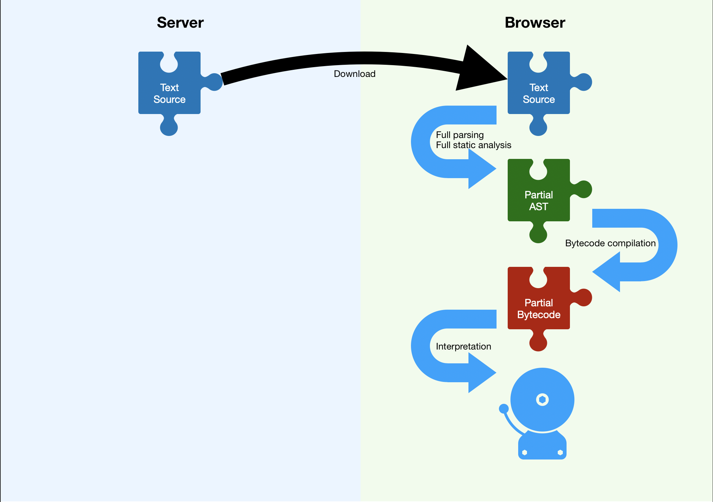
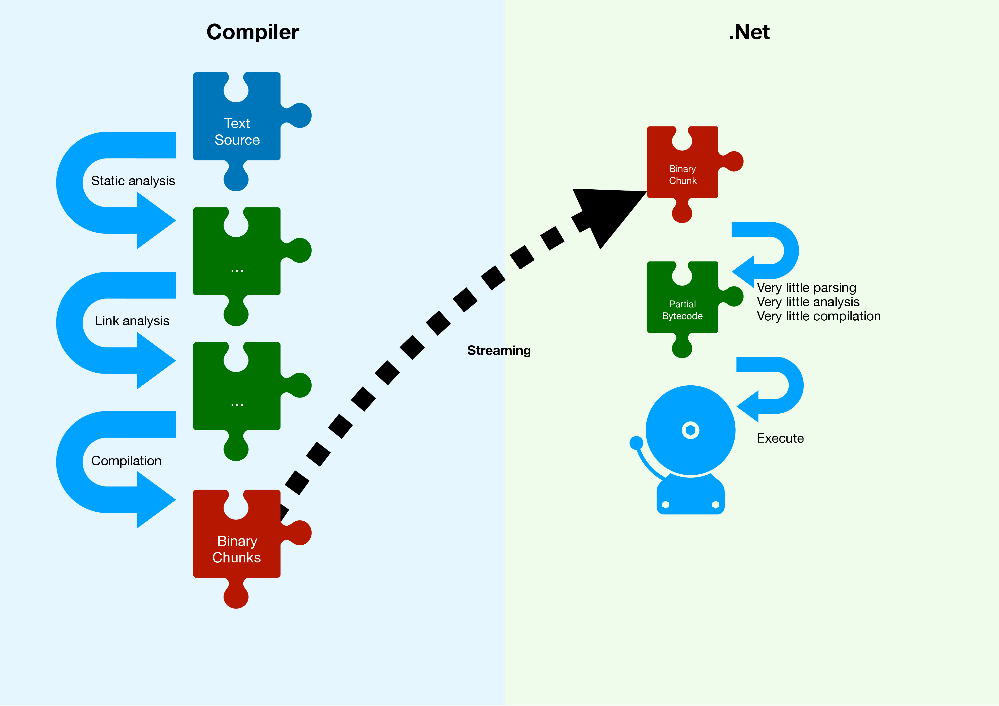
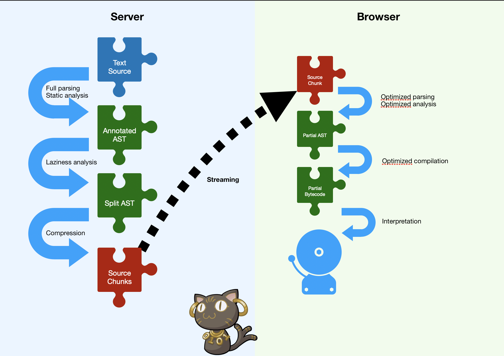

% BinAST
%or
%**Breaking the JavaScript startup bottleneck**

---

David Teller (Yoric), Mozilla, Tech Lead

Joint work:

- Mozilla (SpiderMonkey team, community)
- Facebook (WebPerf team)
- Bloomberg
- CloudFlare

---

## Web application performance matters

- "53% of visits are abandoned if a mobile site takes more than **3 seconds** to load" (source: [DoubleClick](https://docs.google.com/viewerng/viewer?url=https://storage.googleapis.com/doubleclick-prod/documents/The_Need_for_Mobile_Speed_-_FINAL.pdf))

--

- "Apps became interactive in **8 seconds** on desktop (using cable) and **16 seconds** on mobile (Moto G4 over 3G)"(median value, source: [Addy Osmani](https://medium.com/reloading/javascript-start-up-performance-69200f43b201), Google)


---

## What's the problem?

:::incremental

- Code.
- Lots of code.
- How much code do *you* have?
- Code slows you down.
- ...even when you don't execute it.

:::

---

## Parsing


---

# How JavaScript starts

---

## JS startup pipeline


---

## JS startup pipeline



---

## + Optimizations


---

## Contrast with ~native




---


# Introducing BinAST

- JavaScript
- **Bin**ary
- **A**bstract
- **S**yntax
- **T**ree

---

Don't panic.

---

# Hello, BAST


---

# Fixing parsing
Beyond IIFE

---

## Parsing is slow, because

- Tokens are complicated.
- Strings are complicated.
- `eval`.
- `SyntaxError`.
- Closures.

---

## So...

- Simplify tokens, strings.
- Pre-process `eval`, `SyntaxError`, closures.

---

## Instead of this

```js
function foo(x) {
  // No `eval`.
}
```

---

## Store this

```yaml
Names:
  - ["foo", ...]

FunctionDeclaration: // 42
  name: 0            // 0
  eval: false        // 0
  body:              // ...
    ...
```

---

## Results

- Time spent parsing + verifying: -30%.
- Further optimizations coming :)

---

# Fixing download
Beyond minification

---

```js
const log = require('my-logger')('my-module');
const {parse, print} = require('my-parser');
// ...
if (Constants.DEBUG) {
  // ...
}
```

---

- Strings, identifiers, properties are repeated.
- Many repeats across libraries.
- Code has patterns!

---

## So, let's learn

- String, identifier, properties dictionary.
- Code pattern dictionary.
- => ~1.2 bits/code construction.
- => ~2-6 bits/string, identifier, properties use.

---

## Results

- With a good dictionary, ~minification + brotli.
- *Without minification.*
- Further optimizations coming :)

---

# Fixing compilation

---

## Instead of this

```js
function later() {
  // Not used during startup
}
function init() {
  // Used during startup
}
```

---

## Store this

```js
// Initial packet.
function init() {
  // Used during startup
}
```

```js
// Another packet.
function later() {
  // Not used during startup
}
```

---

:::incremental

- ...only {parse, compile} what you execute.
- ...{parse, compile, execute} as you receive.
- So yeah, we're working on *streaming* JavaScript.

:::

---

## Results (lab)

- Time spent parsing: -75% (*).
- Compiling: ~background task (*).

(*) To be confirmed.


---

# Conclusions

---



---

- We can fix JavaScript startup.
- No coding required.
- No language harmed.
- Reduce total work (energy?)

---

## Where's the code?

- Still a WIP.
- https://github.com/binast
- Firefox Nightly (hidden preview)
- Slides: https://yoric.github.io/Fosdem-2019

---

# Soon on a browser / server near you? :)
